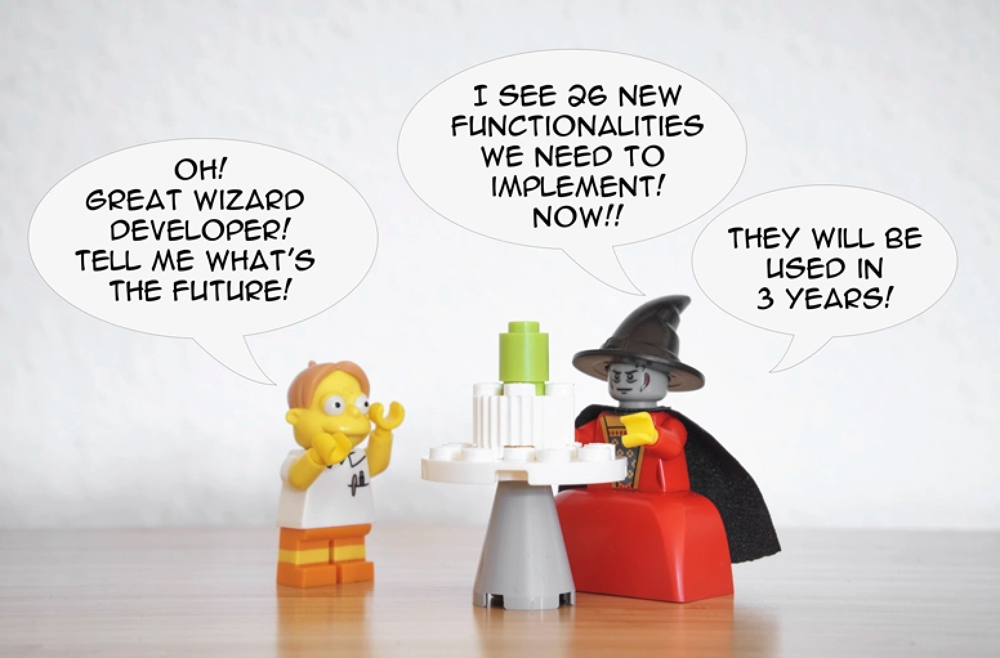
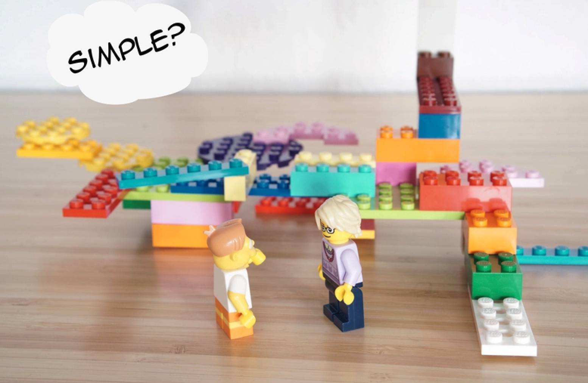

# Подробное объяснение принципа KISS в программном обеспечении


Когда я ищу информацию о принципе KISS в Интернете, я натыкаюсь на множество сайтов, определяющих его в паре строк: важна простота, давайте быть простыми, конец. Они часто не объясняют, что такое простота, почему простота важна и как ее достичь.

Простота - это одна из ведущих идей, которую мы должны помнить всегда, проектируя систему. Проблема: ее действительно трудно достичь.

Вы угадали: мы погрузимся в простоту (и сложность) в этой статье. Я не буду писать обо всех различных способах, которыми сложность может проникнуть в ваш код, но, вместо этого, я постараюсь дать вам краткий обзор различных масок, которые сложность может носить, с множеством примеров. Мы перейдем от самого бизнес-домена, через мелочи (реализацию), чтобы закончить сложностью архитектуры программного обеспечения.

Более точно, мы попытаемся ответить на эти вопросы:

- В чем разница между простым и легким?
- Почему нам нужно сохранять вещи простыми?
- Можем ли мы избежать сложности, создаваемой самим бизнесом?
- Почему мы должны стремиться удалить код?
- Что такое цикломатическая сложность?
- Что означает простота для архитектуры?
- Как управлять своими зависимостями?
- Почему мы не должны пытаться перехитрить всех своим кодом?

## Простой... Или легкий?

Есть важные различия между понятиями "легкий" и "простой", которые нам нужно сначала понять. Давайте начнем с простых определений. Что словарь говорит о простом - [simple](https://en.oxforddictionaries.com/definition/simple)?

> Простой, базовый или некомплексный по форме, природе или дизайну; без многого украшения или орнамента.

> Состоящий из одного элемента; не составной.

Достаточно легко: если ваша система имеет только несколько частей, у вас есть простая система.

Мы также могли бы попытаться определить "простой", посмотрев на определение его противоположности, сложного - [complex](https://en.oxforddictionaries.com/definition/complex):

> Состоящий из многих различных и связанных частей.

Ого! Это интересно. Простая система - это не система с одним и только одним элементом, обязательно. Это система, у которой не слишком много различных элементов, связанных друг с другом.

Если вы все еще не убедились, это здорово: очень важно иметь критический ум. Давайте посмотрим на синоним сложного, [complicated](https://en.oxforddictionaries.com/definition/complicated):

> Состоящий из многих взаимосвязанных частей или элементов; замысловатый.

Я чувствую, как ваш адреналин проходит через все ваше тело, ваши нейроны танцуют танец понимания, и ваша душа проецирует свет знания во вселенную. Опять та же идея!

Теперь, в чем разница с легким - [easy](https://en.oxforddictionaries.com/definition/easy)? Давайте снова откроем словарь:

> Достигнуто без больших усилий; представляет немного трудностей.

Допустим, вам нужно сделать сложение в двоичной системе, и вы не знаете, как это сделать: это не легко для вас. Вам не хватает знаний. Но ваше сложение - это не система с большим количеством частей. Это не система с соединенными частями. В результате, это трудно для вас, но это также просто.

Еще один пример: если у вас есть код с 18237 классами, все [связанные](https://thevaluable.dev/cohesion-coupling-guide-examples/) друг с другом, у вас есть сложная система: слишком много элементов (классы) переплетены друг с другом. Даже если вы можете понять каждый отдельный алгоритм в вашей системе (они легки для вас), сама система остается сложной.

Чтобы подвести итог, вот два греха сложности:

- Слишком много частей в системе.
- Слишком много взаимосвязанных частей в системе.

Теперь, когда мы действительно знаем, что такое сложность (и, по расширению, простота), вы, возможно, задаетесь вопросом:

- Почему важно для разработчика программного обеспечения заглянуть в скучный словарь?
- Почему простоту следует рассматривать как Бога, который спасет нас всех?

## Почему нам нужна простота?


Почему быть разработчиком программного обеспечения может быть сложно? Один ответ: изменения.

Если приложение, которое вы создаете, никогда не будет меняться, немедленно прекратите чтение этой статьи! На самом деле, не читайте ничего о хороших принципах разработки программного обеспечения, это бесполезно для вас. Просто напишите процедурный код на любом языке, который вы хотите, не следуйте никаким принципам, и у вас все получится. В любом случае никто не будет смотреть на ваш код.

База кода, которая не меняется, - это миф. Контекст вокруг вашего приложения будет меняться (библиотеки, рынок…) и, как результат, ваше приложение тоже потребует изменений. Чтобы изменить ваше приложение, вам придется понять, как работают вместе разные части вашей системы. Это представление, которое находится в вашем мозгу, - это ментальная модель вашей системы.

В зависимости от системы, ваша ментальная модель будет более или менее точной. Что насчет сложных систем? Я уверен, вы догадались: создать точную ментальную модель сложного приложения сложно и утомительно.

> Контроль сложности - суть программирования. Мы всегда будем ограничены количеством деталей, которые мы можем держать прямо в наших головах.
>
> Брайан Керниган

Давайте посмотрим на базу кода Дейва, вашего коллеги-разработчика. Она полна скрытых зависимостей и [глобального изменяемого состояния](https://thevaluable.dev/global-variable-explained/). Когда вы что-то меняете, вы не имеете представления о волнах эффектов, распространяющихся по всей базе кода. Ваш уровень энергии снижается, когда вы пытаетесь уложить все в голове, и, в конце концов, ваш гнев возрастает. В этот момент вы можете удивить себя, проклиная семью Дейва на несколько поколений.

Результат сложных систем? Баги, несчастные разработчики, риск [выгорания](https://thevaluable.dev/burnout-software-developer/) и разочарованные клиенты в конце цепочки. Никто этого не хочет.

## Сложность бизнеса

Сложность системы также будет хорошим показателем количества времени, которое разработчикам потребуется, чтобы добавить новую функциональность. Это действительно важно с точки зрения бизнеса. В наши дни организации нужно иметь хорошую адаптивность и скорость (скорость с направлением), чтобы преуспеть.

Однако мы не всегда можем избежать сложности. Прежде всего, это зеркало сложности бизнеса, для которого мы создаем приложение. Сложность требований определит большую часть сложности наших систем!

Например, если вы разрабатываете электронную коммерцию, вам будет трудно избежать наличия продуктов, заказов, отправок, управления запасами или возвратов. Там много движущихся частей.

Вот почему, будучи разработчиком, вы должны помнить следующее:

- Если вы можете избежать сложности, избегайте ее, насколько это возможно.
- Если вы не можете, вам нужно убедиться, что вы правильно управляете ей.

Как черт возьми мы это делаем?

### Проще требования

Чтобы избежать как можно большей бизнес-сложности, я предлагаю напрямую атаковать сложность бизнес-требований. Как?

1. Если у вас нет планового собрания, где разработчики и бизнес-люди (менеджеры проектов и прочие) обсуждают требования, пожалуйста, попросите о нем. Настаивайте на этом пункте, пока вы его не получите. Не следуйте слепо за тем, что вам навязывает высшее руководство. Они могут этого не понимать, но у разработчика есть много ценных знаний, которые могут помочь уменьшить сложность требований.

2. Во время этих собраний, когда вы видите потенциальную функцию, которая привнесет много сложности, задавайте вопросы, начинающиеся с "почему". Зачем нам эта функция? Почему она полезна для нашего клиента?

3. Если вам действительно нужна эта функция (что будет часто случаться), у вас может быть лучшая идея, как сделать ее проще. Например, что насчет того, чтобы иметь 10 полей вместо 20 для формы регистрации пользователя? Кроме того, функция, которую проще реализовать, часто будет проще и для клиента. Это хороший аргумент, чтобы продать вашу идею вашим заинтересованным сторонам.

Тем не менее, имейте в виду, что уменьшение сложности непосредственно в требованиях сложно. Почему?

Во-первых, многие заинтересованные стороны, кажется, женаты на своих идеях. Это нормально: когда у нас есть идеи, мы часто думаем, что это ИДЕЯ, которая изменит мир. Мы часто имеем тесные отношения с ними, ассоциируя наши идеи с тем, кто мы есть. Это ошибка: эти идеи - внешние сущности. Они не являются продолжением наших личностей.

Кроме того, чем больше мы работаем над нашими идеями, тем больше мы будем чувствовать потребность получить что-то из этого. Даже если идея очень плохая, мы можем застрять на ней долгое время.

Если вы видите, что кто-то слишком привязан к своим идеям, [знание того, как правильно аргументировать](https://thevaluable.dev/guide-debate-software-developer/), может помочь здесь.

Во-вторых, иногда невозможно упростить функцию. В этом случае попытайтесь уменьшить сложность насколько это возможно при ее реализации. Об этом позже.

Однако помните: если вы попытаетесь **понять бизнес-область, для которой вы работаете**, вы найдете более простые решения. Постарайтесь говорить с экспертами в области (людьми, обладающими знаниями самого бизнеса), насколько это возможно, всегда обновляйте свои знания и избегайте чрезмерной уверенности в том, что вы знаете.

Клиенты, в конце цепочки, должны быть теми, кто откажется от идей и функций. Слушать их крайне важно.

## Хорошая реализация - это удаленная

Меньше кода часто делает вашу систему проще. Большой часто синоним сложности.

Действительно, изменение вашего кода может повлиять на окружающий код и создать нежелательные результаты. Если подумать, строки кода - это потенциальные технические долги, источники ошибок, причины головной боли, криков и слез. Не показывайте милосердия: удалите каждый бесполезный фрагмент кода, который вы можете найти.

Как известно, Антуан де Сент-Экзюпери сказал:

> Совершенство достигается не тогда, когда нечего добавить, а тогда, когда нечего убрать.

Достаточно сказано.

### Мертвый код


Вы хотите, чтобы на вашей блестящей системе было полно старых функций, гниющих на кладбище? Я тоже нет.

Но сначала, что такое мертвый код? Все, что не используется в приложении во время выполнения: переменные, инициализированные, но никогда не вызываемые, методы, которые никогда не используются, классы, которые никогда не инстанцируются.

Оставляя свой мертвый код вокруг, вы столкнетесь со следующими последствиями:

- Разработчики будут сбиты с толку, работая над системой. Вопросы и сомнения будут мучить их: какова цель кода? Должен ли я его оставить? Это полезно?
- Ваши коллеги, возможно, будут поддерживать его, тратя время на рефакторинг без какой-либо выгоды.
- Мертвый код скрывает реальную реализацию. Вы уже спрашивали себя: "почему, когда я изменяю этот метод, ничего не происходит"? Я спрашивал. Со временем это надоедает.

Упрощение наших баз кода путем удаления мертвого кода упростит наши ментальные модели. Это означает меньше головных болей и меньше энергии, уходящей в эти бесполезные зомби.

### Принцип YAGNI

Специфическая форма сложности (или мертвого кода), которую часто яростно защищают разработчики, - это знаменитый код, который будет полезен однажды, в будущем, поэтому мы должны его сохранить.

Отсюда идет принцип YAGNI: это означает "Вам это не понадобится" (You Aren’t Gonna Need It). И это правда, 99% времени: вы никогда не знаете, что произойдет в будущем, и код, пытающийся предсказать будущее, никогда не будет использоваться и будет забыт.

Если вы наткнетесь на какой-то код, написанный без каких-либо актуальных целей, удалите его. Если вам потребуется реализовать его в будущем, это будет в другом контексте, и ваш старый код все равно станет устаревшим. Вы все равно можете вернуться к своей первой реализации, которую вы удалили, с помощью системы контроля версий ([git](https://git-scm.com/), кто-нибудь?).

Я не считаю, сколько [дебатов](https://thevaluable.dev/guide-debate-software-developer/) я провел на эту конкретную тему в течение своей карьеры. Вот пример:

- Я: Почему функциональность надевания шляпы на пользователей реализована в системе? Я не вижу этой опции на фронтенде... но она везде на бэкенде!
- Коллега: Она сейчас не используется. Но мы обязательно будем использовать ее однажды.
- Я: Но... она была реализована в 2016 году, сейчас 2019 год. Если никому не нужно было это в течение трех лет, возможно, нам не понадобится это еще два года. Мы могли бы удалить это.
- Он: Нет. Это слишком сложно. Мы обязательно будем использовать это.
- Я: ... но разработчики будут поддерживать это. Я сам потратил часы, чтобы понять, как управлять этим, так как я реализую что-то непосредственно связанное, что может это нарушить.
- Коллега: Нам это обязательно понадобится.
- Я: ... а что насчет этой функции, которая квалифицирует пользователя как "волшебника"?
- Коллега: О, она не используется. Но она обязательно будет использоваться однажды.
- Я: ...

Никто не знает будущего. Функциональность может быть отменена или оставаться в бэклоге навсегда. Контекст меняется. Тем временем, бесполезные функции будут поддерживаться, иногда с большими усилиями, впустую.

Тем не менее, я видел, как разработчики тратят огромное количество времени, чтобы быть настолько гибкими, насколько это возможно, для гипотетических следующих функций, которые никогда не приходят.

**Добавляйте только ту сложность, которая вам нужна, чтобы ответить на текущие бизнес-потребности, не больше.**

Мы - разработчики, а не гадалки.



### Глобальные состояния и поведения

Использование глобальных состояний 99% времени - не лучшая идея. Я [написал подробную статью об этом здесь](https://thevaluable.dev/global-variable-states/), также объясняя опасности состояний с растущими областями видимости.

## Простая архитектура

> Сложность убивает. Она высасывает жизнь из разработчиков, она делает продукты сложными для планирования, создания и тестирования, она вводит проблемы безопасности и вызывает разочарование конечных пользователей и администраторов.
>
> Рэй Оззи

### Архитектура лазаньи



Лазанья - вкусное блюдо (когда оно хорошо приготовлено), но кошмар в базе кода. Проблема архитектуры лазаньи? Слишком много слоев косвенности.

Давайте представим, что у вас есть приложение, которое просто принимает некоторые входные данные от API, применяет некоторую бизнес-логику для преобразования данных и сохраняет их где-то. Звучит разумно, не так ли?

Вот что вы можете сделать. Каждый пункт - это слой:

1. API, получающие некоторый запрос.
2. Обертки API.
3. Фабрики серверов, которые создают разные контроллеры и внедряют обертки API.
4. Пул фабрик серверов, на случай, если вы хотите иметь их несколько (?).
5. Контроллеры, где вызываются обертки API через конструкции интерфейса.
6. Слой валидации для проверки входных данных.
7. Еще один слой для обмена кодом между каждым контроллером (в попытке сделать все как можно более DRY).
8. Слой модели, который такой же глупый, как мои ноги ([анемичные модели](https://thevaluable.dev/anemic-domain-model/)).
9. Слой состояния, вызываемый через конструкции интерфейса из контроллеров.
10. Еще один слой, который получает только идентификаторы сущностей, чтобы получить всю сущность.
11. Слой, который выполняет фактическую CRUD **и** реализует реальную бизнес-логику. В случае выборок этот слой делает некоторый SQL-запрос, получает только идентификаторы и передает их на слой 10, который будет извлекать сущность.

Вы не поняли всю картину? Это нормально.

Теперь представьте себе, что вы пытаетесь изменить некоторую функциональность. Вам, возможно, придется:

- Пройти через большую часть слоев.
- Попытаться выяснить, не упадет ли один слой из-за вашего изменения.
- Попытаться вспомнить, как все работает в вашем болезненном мозге.
- Внести свое изменение.
- Подумать, что делал слой.
- Проверить все снова.
- Исправить три теста, провалившихся на 4 слоях. Два дня работы только на это.
- Позвонить своему парню, девушке или любимому коту, крича, что [вы такой мошенник](https://thevaluable.dev/understand-overcome-imposter-syndrome/).
- Мечтать о маленьком домике в горах, где вы можете проводить время, делая козий сыр, вместо того чтобы тратить его на какую-то ерунду.

Вам потребуется ментальная модель, распространяющаяся на 11 слоев, чтобы правильно управлять изменениями вашей базы кода. Удачи!

Теперь вы, возможно, думаете, что я сумасшедший. Вы, возможно, думаете, что такую архитектуру создал мой больной мозг. Вы, возможно, думаете, что такие базы кода не существуют. Но это приложение реально: я работал над ним достаточно, чтобы все еще чувствовать боль, когда думаю об этом.

Знаете что? Эта база кода была полна хороших намерений. Разработчики, ответственные за это чудовище, не хотели создавать сложную систему намеренно. Они хотели помочь всем, создав что-то чрезвычайно гибкое, элегантное, DRY, идеальное программное обеспечение.

Как говорил мой старый друг Сен-Бернар из Клерво:

> Дорога в ад вымощена хорошими намерениями.

Предыдущий пример будет полезен для объяснения, почему ненужные абстракции могут сделать вашу систему более сложной.

### Абстракции и сложность

Что такое абстракция? Это способ справиться со сложностью, скрывая некоторые бесполезные детали. Я подробно писал об этом [в другой статье](https://thevaluable.dev/abstraction-software-development/).

Например, функция - это абстракция: когда вы вызываете функцию в своем коде, вы не обязательно будете знать ее реализацию и, следовательно, ее сложность. Вместо этого вы:

1. Посмотрите на сигнатуру функции (ее имя, вход и выход).
2. Решите использовать ее или найти что-то лучше.

Звучит здорово, не так ли? Больше не имеет значения, насколько сложна система! Давайте разработаем большой Комок Грязи и добавим на верх слои красивых, цветущих абстракций, чтобы скрыть весь беспорядок.

Ну, не совсем.

Как мы видели, функции можно рассматривать как абстракцию. Объекты в ООП тоже. Даже некоторые примитивы вашего любимого языка программирования, например, массивы, можно рассматривать как абстракцию более общего понятия (например, математической последовательности).

Для работы ваших абстракций вам нужно создавать связные реализации, где вещи, которые принадлежат друг другу, находятся вместе. В противном случае сложность просто всплывет на вашем лице, как пиявка психического здоровья. Рассмотрите этот пример:

```php
<?php

$this->createOrderAndMoveStockAndDeliverToUser();
```

Что нам говорит эта абстракция?

1. Реализация выглядит так, будто она занимается многими вещами: заказами, запасами и доставкой. Три концепции, все вместе.
2. Метод содержит концепции, которые не принадлежат друг другу. Вы можете создать заказ без перемещения запасов, и вы можете перемещать запасы без создания заказа.
3. Даже если сложность абстрагирована и скрыта, она все равно существует. Она просто скрыта, а не устранена.
4. Если вы измените создание заказа, процесс перемещения запасов и доставки может быть затронут, даже если они независимы.

Эта абстракция скрывает сложность, но также не предлагает простоты. В этом случае вашим девизом должно быть "Разделяй и властвуй".

```php
<?php

$this->createOrder();
$this->moveStocks();
$this->deliverToUser();
```

Теперь методы [более сфокусированы](https://thevaluable.dev/single-responsibility-principle-revisited/). Логика, содержащаяся в себе, - это хороший способ справиться со сложностью. Это называется инкапсуляция, и это один из самых основных принципов, которые мы все должны иметь в виду при кодировании.

Давайте рассмотрим еще один из этих основных принципов.

### Стоимость полиморфизма


Полиморфизм - это основная концепция в программировании: это способность модуля (класса, пакета и тому подобного) принимать различные формы. Вы можете использовать конструкцию интерфейса для этого, например:

```php
<?php

namespace App;

interface Checkout
{
    public function addProduct();
}
```

Конструкции интерфейса действительно замечательны, не так ли? Они позволяют вам заменить часть вашей системы, не влияя на все вокруг. К сожалению, полиморфизм также может привнести много сложности. Вы помните архитектуру лазаньи, которую я описывал несколько абзацев выше? Многие слои имеют интерфейсы ради гибкости.

Вы хотите хранить свои сущности в файле вместо базы данных? Полиморфизм через интерфейсы может позволить вам это сделать. Это здорово, но все, в волшебном мире разработки, имеет свою цену:

- Трудно знать, какая реализация действительно используется во время выполнения. Косвенность может привести к множеству путаницы.
- Вам, возможно, придется обновлять эти конструкции интерфейса каждый раз, когда вы добавляете или изменяете реализацию. Со временем они могут становиться все больше и больше, что является ясным признаком того, что вы не должны абстрагировать это.

Давайте вернемся к моему приложению с 11 слоями: у него есть 68 интерфейсов для 26759 строк кода. Это означает, что в среднем на каждый блок из 393 строк кода приходится один интерфейс. Кто хочет менять реализацию стольких частей? Это когда-нибудь произойдет? Ответ, скорее всего, "нет".

В общем, спросите себя: **нужна ли вашему приложению такая гибкость?**

Не поймите меня неправильно: интерфейсы очень полезны в некоторых случаях. Если вам нужно, сейчас, в настоящее время, заменить существующую реализацию на другую существующую во время выполнения, пожалуйста, продолжайте. Если вы думаете, что вам это понадобится, в будущем, для будущих реализаций, подождите, пока вы там не окажетесь.

Теперь вы, возможно, слышали о следующем, от знаменитой [Банды Четырёх](https://en.wikipedia.org/wiki/Design_Patterns):

> Программируйте на 'интерфейс', а не на 'реализацию'.

Это звучит противоречиво! Должны ли мы использовать интерфейсы для всего?

Термин "интерфейс", в этом случае, не относится к конструкции интерфейса, которую вы можете найти во многих языках. Это означает, что вам [нужно развязать свои зависимости](https://tuhrig.de/programming-to-an-interface/), если вам это нужно, используя любую конструкцию, которую вы хотите. Простая обертка может быть достаточной.

Давайте немного поговорим об этой проблеме зависимости.

### Проблема зависимости


Можно с уверенностью сказать, что слишком много зависимостей в системе делают ее сложной. В конце концов, по своей природе, зависимости связывают части вашей системы друг с другом: само определение Непрощенного Второго Греха Сложности Смерти.

**Необходима ли зависимость?**

Когда вы создаете новые зависимости между классами или модулями, спросите себя:

1. Действительно ли эти зависимости необходимы? Возможно ли не связывать ваш код?
2. Если они необходимы, как я могу сделать зависимости очевидными?

Подумайте о бизнесе, для которого вы работаете: имеет ли смысл создавать зависимости в конкретном контексте, в котором вы находитесь? Необходимо ли связывать логику доставки с логикой заказа, например? Не совсем: заказ может существовать без доставки, поэтому заказ не должен иметь зависимостей с логикой доставки.

Эти вопросы действительно важны, и они могут сделать огромную разницу со временем. Это может остановить ваших коллег от того, чтобы кидать в вас камни, когда вы едите в столовой компании.

**Управление сложностью зависимостей**

Группировка всех зависимостей в одном месте может значительно помочь в понимании сложности системы на первый взгляд. Это поможет вам иметь точную ментальную модель ваших зависимостей. Например, контейнер для внедрения зависимостей может помочь в этом отношении, но это не единственное решение. Когда я кодирую на Golang, например, я просто объявляю все мои зависимости в том же пакете.

Управление вашими зависимостями прозрачным образом уменьшит вероятность влияния на другую часть вашего кода при внесении изменений. Это послужит руководством для всех, кто работает над вашим проектом.

Поэтому не очень хорошая идея внедрять зависимости через сеттеры или другие методы в ваших классах. Лучше всего внедрять их в конструкторы: тогда их проще найти. Если они внедряются и управляются в случайных методах, как вы можете найти их обратно без борьбы? Это хороший способ вызвать Демона Сложности™ на ваше бедное приложение, на ваших коллег и на вашу компанию.

Давайте рассмотрим очень простой пример:

```php
<?php

class ProductCollection
{
}

// This is a clear implementation.
// 1. The dependency productCollection is directly visible in the constructor, at the beginning of the class.
// 2. It indicates that the class Order needs a productCollection to be  instantiated.

class Order
{
    /** @var ProductCollection */
    private $productCollection;

    public function construct(ProductCollection $productCollection)
    {
        $this->productCollection = $productCollection;
    }

    // More methods
}

// This is not obvious enough.
// 1. The setter is lost in a bunch of other methods.
// 2. It's confusing: when does the productCollection should be injected? Is it important? In what case?

class ShoppingCart
{
    // Bunch of other methods

    public function setProductCollection(ProductCollection $productCollection)
    {
        $this->productCollection = $productCollection;
    }

    // More methods
}
```

## Не пытайтесь перехитрить своих коллег

В качестве закуски позвольте мне процитировать М. А. Джексона, который написал "Принципы проектирования программ":

> Погромисты... часто прибегают к понятной, но губительной склонности к сложности и изобретательности в своей работе.

Это общий шаблон, который я вижу все время.

Иногда мы пытаемся показать, насколько мы умны, даже не осознавая этого. Мы вносим шаблоны проектирования в наши базы кода без веских причин и изобретаем умные способы делать вещи, которые могут понять только Лучшие из Лучших, Истинный Разработчик, Элита Бинарного, Чемпион Кода Галактики.

Как говорил Бьярне Страуструп:

> Сделайте простые задачи простыми!

Вы можете признать, что у вас есть эта проблема в вашей компании, когда вы увидите сложную архитектуру CQRS, фабрики повсюду, декораторы, пулы, для приложения CRUD. Вкратце, высокая техническая сложность для простых проблем.

Цель разработчика - помочь компании работать плавно и удовлетворять своих клиентов, а не создавать кучу сложности, используя каждый шаблон проектирования, который только можно знать.

Я разработчик. Я знаю, как весело играть с новыми технологиями и другими игрушками. Компании определенно должны позволять нам экспериментировать, чтобы привнести лучшие технологии и методы для решения поставленных задач. Но если вы видите, что технология (или метод) не приносит компании никакой ценности, вам нужно отказаться от этой бесполезной сложности.

Давайте продолжим наш пир цитат с Ричем Хики:

> Шаблоны означают "У меня закончился язык".

Если у вас действительно нет другого решения, если вам нужна большая гибкость, потому что требования сложные, то да, в любом случае, внедрите практику или технологию, которая вам нужна. Но прежде чем делать это, попытайтесь выяснить, может ли язык программирования, который вы используете, предложить уже достойное решение, не прибегая к вашим сложным шаблонам проектирования.

Это также означает, что вы должны вводить этот вид сложности только при рефакторинге. Постарайтесь не вводить сложность, когда вы впервые пишете новый фрагмент кода.

KISS означает: Keep It Simple Stupid. Нет, это не означает, что вы глупы. Вы очень умны и красивы.

Это означает, что ваш код должен быть глупо простым. Он должен быть настолько простым, что каждый должен понимать, что делает система, и как можно быстрее усваивать хорошую ментальную модель этого. Он должен быть настолько простым, что когда вы уйдете из компании, младший разработчик сможет продолжить ваш шедевр.

Чтобы вернуться к моей архитектуре лазаньи с 11 слоями, дизайн был создан заранее, с единственной целью гипергибкости. Это не было переписыванием или рефакторингом.

Я не затронул всю сложность этого приложения. Автор пытался также следовать некоторым парадигмам CQRS с подходом [анемичной модели домена](https://thevaluable.dev/anemic-domain-model/). Реализация возможности для пользователя копировать другого пользователя заняла у меня два полных дня. Это должно было занять пару часов, включая тесты.

Как правило:

- Кодируйте как можно ближе к своим непосредственным потребностям.
- Оставайтесь как можно ближе к бизнес-проблеме.
- Будьте как можно более ясными относительно цели каждого фрагмента кода. Не прячьте его за [абстрактными обобщениями](https://thevaluable.dev/abstraction-type-software-example/).
- Чрезмерная гибкость и предсказание будущего могут ввести много технических долгов.

Не пытайтесь быть самым умным парнем в комнате. Постарайтесь быть настолько глупо простым, насколько это возможно.

## Разработка снизу вверх

Я хотел бы описать метод разработки, который заставляет меня оставаться простым и как можно ближе к требованиям, не впадая в безумно сложные предположения: разработка снизу вверх.

1. Начните с реализации самого нижнего слоя вашего приложения.
2. Кодируйте только то, что вам нужно, чтобы ваша функция работала.
3. Протестируйте это.
4. Отрефакторьте свой код, если это необходимо.
5. Переместитесь на один слой вверх.
6. Кодируйте только то, что вам нужно, чтобы ваша функция работала.
7. Протестируйте ваш новый код, если это необходимо (то есть, если этот слой имеет какую-либо логику, иначе вы будете тестировать код на верхнем слое дважды).
8. Вернитесь к пункту 4.

Модульные тесты могут заставить вас увидеть, правильно ли ваш код декомпозирован. На самом деле, очень трудно тестировать, когда ваши модули (классы, пакеты и тому подобное) взаимосвязаны: вам придется создавать моки для всех из них, что является очень хорошим и болезненным индикатором того, что вы должны упростить вещи, если можете. Если вы не можете, не создавайте для них моки: напишите интеграционные тесты и отбросьте свои модульные тесты.

Я не буду вдаваться в подробности о тестировании, сама по себе тема заслуживает отдельной статьи. Просто помните, что автоматизированные тесты помогают вам упрощать (и рефакторить) вашу базу кода. Это важно, чтобы база кода включала автоматизированные тесты; они должны рассматриваться как часть вашего приложения.

## Принцип KISS вкратце

Эта статья не предназначена для исчерпывающего списка всего, что может привести к сложности в программном обеспечении. Я хочу показать, как сложность может быстро возрастать из многих разных источников.

Если вам нужно запомнить только одну вещь, то это: сложность нужно учитывать на каждом этапе жизни базы кода. Во время проектирования, реализации, рефакторинга, исправления ошибок и, в конечном итоге, переписывания.

Чтобы подвести итог тому, что мы узнали вместе:

- Простая система не имеет слишком много частей и, что более важно, не имеет слишком много зависимых, взаимосвязанных частей.
- Если вы можете иметь ясную ментальную модель той части базы кода, над которой вам нужно работать, сложность хорошо управляется в этой области базы кода.
- Если вы можете, попытайтесь уменьшить сложность функций, которые ваши менеджеры пытаются построить, предлагая (почти) эквивалентные решения. Вам понадобятся хорошие, связанные с бизнесом аргументы (говорите о деньгах и времени).
- Удалите каждый бит кода для ваших **текущих** потребностей. Никто не знает, что произойдет в будущем.
- Избегайте [глобальных изменяемых состояний и поведений](https://thevaluable.dev/global-variable-explained/), как чумы.
- Не создавайте слишком много слоев косвенности в вашем приложении.
- [Абстракции](https://thevaluable.dev/abstraction-software-development/) должны быть созданы, когда вам нужно обобщить или упростить некоторые знания сейчас (а не в будущем).
- Четко покажите, где управляются зависимости вашего приложения.
- Будьте осторожны, чтобы не связывать ваши модули (классы, например), если вы можете найти лучшее техническое решение.
- Не пытайтесь показать, сколько вы знаете в своей базе кода. Имейте в виду, что любой должен быть способен изменить его; даже новичок.

Что в конце концов означает "оставаться простым"? Должны ли мы перестать говорить об общем понятии "простоты" (или принципе KISS) и попытаться определить (назвать) конкретную проблему, чтобы найти адаптированное решение?

В следующий раз, когда вы поймаете себя на мысли, что "нам следует упростить систему", вы могли бы сказать вместо этого: "этот класс A слишком связан с этим другим классом B, давайте найдем решение".

Я хотел бы закончить эту статью предупреждением: "простой" - это хорошо, "неполный" - это плохо. Вашей первой целью является то, чтобы ваш код работал так, как ожидается. Простая, красивая система, которая не делает то, что должна делать, бесполезна!
